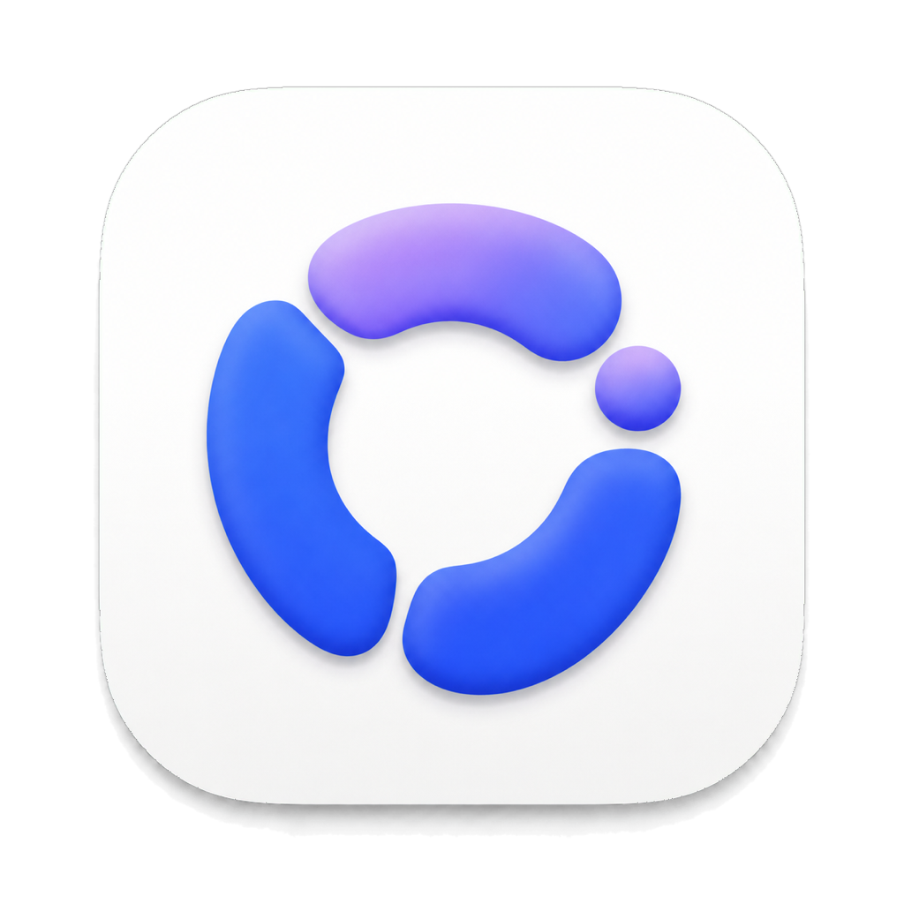

<p align="center">
  
</p>

<h1 align="center">QuotaPulse</h1>

<p align="center">A private, native quota, activity, and alert companion for Codex and Claude on macOS.</p>

<p align="center">
  
  
  
</p>

QuotaPulse is a native macOS menu bar and floating companion for Codex and Claude, with an optional DeepSeek API balance query. It privately presents remaining quota, reset times, local activity, and configurable alerts in a restrained Liquid Glass interface.

## Features

- Shows Codex and Claude together or independently; providers that are not signed in do not reserve space.
- Detects the quota windows currently returned by each service. A temporarily unavailable five-hour window is hidden automatically and reappears when the service restores it.
- Displays reset times, available Codex quota resets, and the expiration time of each reset opportunity when the service provides that data.
- Adds the continuously calculated planned remaining percentage to the weekly quota ring, with a setting to use all 7 days or pause the plan on weekends.
- Detects local Codex and Claude activity and highlights only the provider currently in use.
- Collapses into separate provider badges when the pointer leaves and expands into a unified detail panel on hover.
- Restores the floating panel to a safe top-right position on the primary display whenever you choose “Show Quota Window” from the menu bar, and automatically recovers it after a drag leaves too little visible to grab.
- Adapts the background to quota health and current local weather.
- Colors each quota ring independently: blue above 50%, amber from 10% through 50%, and coral at 10% or below.
- Keeps a compact dual-ring indicator and the lowest remaining percentage in the menu bar.
- Runs as a single app instance to avoid duplicate quota refreshes, windows, and notifications.
- Imports and exports non-sensitive app configuration from the menu bar for local backup and migration.
- Supports instant Simplified Chinese and English switching in the floating panel and Settings, with the preference saved locally.
- Supports launching automatically after macOS login.
- Supports configurable quota alerts with either one fixed interval or two consumption stages.
- Optionally queries and displays DeepSeek API account balances from a user-configured curl template, with immediate save/query feedback.
- Provides a loopback-only HTTP notification API for local scripts and other programs. The endpoint and Bearer token are available in Settings.
- Supports scheduled reminders whose click actions can open links or paths, run Shortcuts/Python, or execute the fixed DeepSeek balance request; new reminders appear first, and completed one-time reminders remain available for reuse.

## Installation

Public builds must be signed with a Developer ID Application certificate and notarized by Apple. When a signed release is available:

1. Download the latest `QuotaPulse-x.y.z.dmg` from [GitHub Releases](https://github.com/MeowkingCP/QuotaPulse/releases).
2. Open the DMG and drag QuotaPulse into Applications.
3. Launch QuotaPulse and allow location access if you want the live weather background.
4. Make sure Codex and/or Claude Code is already signed in for the current macOS user.

No unsigned build is published as an end-user release. Files containing `UNSIGNED` in their name are local development artifacts and must not be redistributed. See the [installation guide](docs/INSTALL.md) for details.

## Privacy

QuotaPulse does not operate an account or quota relay server:

- Codex credentials are loaded read-only from the local `CODEX_HOME/auth.json` file, which defaults to `~/.codex/auth.json`.
- Claude credentials are read from Claude Code's local secure storage and are written back only when the official token refresh flow requires it.
- The optional DeepSeek API key is stored as plain text in app preferences after the user enables and configures that feature.
- Configuration backups exclude provider credentials, the DeepSeek API key, and the local notification API token.
- Quota requests are sent directly to the corresponding provider endpoints.
- Location coordinates are used only to request local weather. They are not combined with quota credentials or written to project logs.

See [PRIVACY.md](PRIVACY.md). By using this project, you acknowledge that it depends on local authentication formats and quota endpoints currently exposed by third-party services, which may change in the future.

## Local Development

Requirements: macOS 14 or later, Xcode Command Line Tools, and Swift 6.

```bash
git clone https://github.com/MeowkingCP/QuotaPulse.git
cd QuotaPulse
swift test
./script/build_and_run.sh --verify
```

Regenerate the application icon:

```bash
./script/generate_app_icon.swift
```

Maintainers can find the signing, notarization, and DMG workflow in the [release guide](docs/RELEASING.md).
Development follows the repository's [spec-first workflow](docs/SPEC_WORKFLOW.md); see the [documentation map](docs/README.md) and [architecture overview](docs/ARCHITECTURE.md) before changing behavior.

## Project Structure

```text
Sources/QuotaPulse/
  App/        Application lifecycle and menu bar entry point
  Models/     Quota and weather data models
  Services/   Codex, Claude, location, weather, and login-item clients
  Stores/     Refresh, merge, and activity state
  Views/      Liquid Glass floating interface and Settings
script/       Build, icon generation, signing, and release scripts
Tests/        Data parsing and policy tests
docs/         Architecture, feature specs, installation, and release guides
skills/       Project-local Codex workflows for UI conventions and local installation
```

## Contributing

Issues and pull requests are welcome. Read [CONTRIBUTING.md](CONTRIBUTING.md) and [SECURITY.md](SECURITY.md) before submitting a change.

QuotaPulse is not affiliated with or endorsed by OpenAI or Anthropic. All related names and trademarks belong to their respective owners.

## License

[MIT](LICENSE) © 2026 QuotaPulse Contributors
